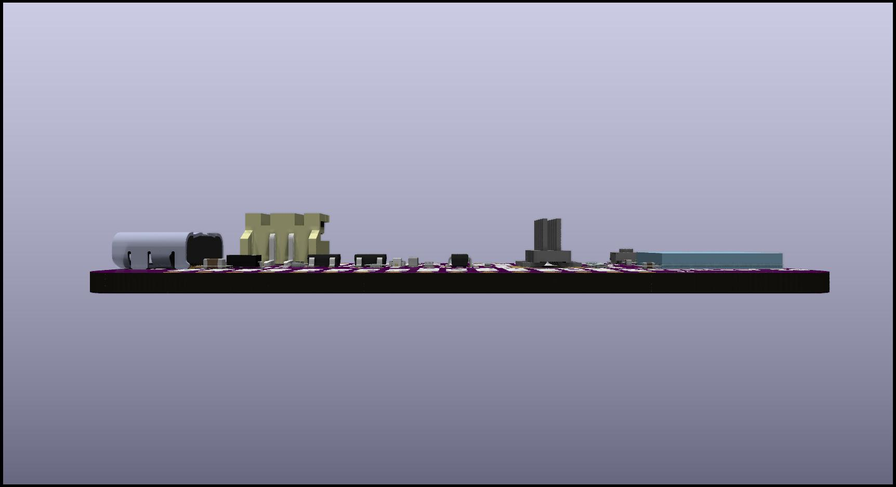
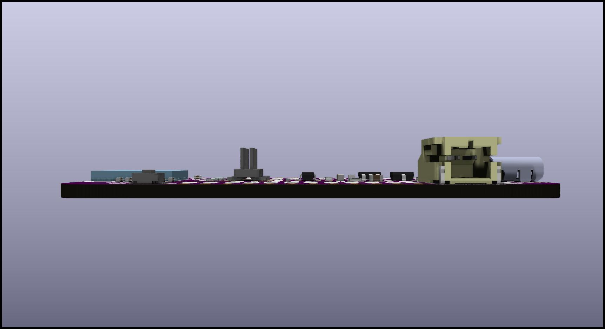

# DarkLeaf
Adafruit Feather style board for the STM32WB5MMGH6TR 2G RF Module

Quick Specs:
- STM32WB5MMGH6TR 2G RF Module
- Adafruit Feather pinout and formfactor
- ARM Cortex M Debug Port
- USB C Connector For DFU Flashing (USB 2.0 interface)
- LiPO powered w/ onboard 3.3V LDO Regulator
- Can be powered directly by 3.3V when breadboarded

KiCAD 2D PCB Render 

3D KiCAD PCB Renders 

Prototype made by OSHPark.com 

Released Under CERN Open Hardware License Version 2
